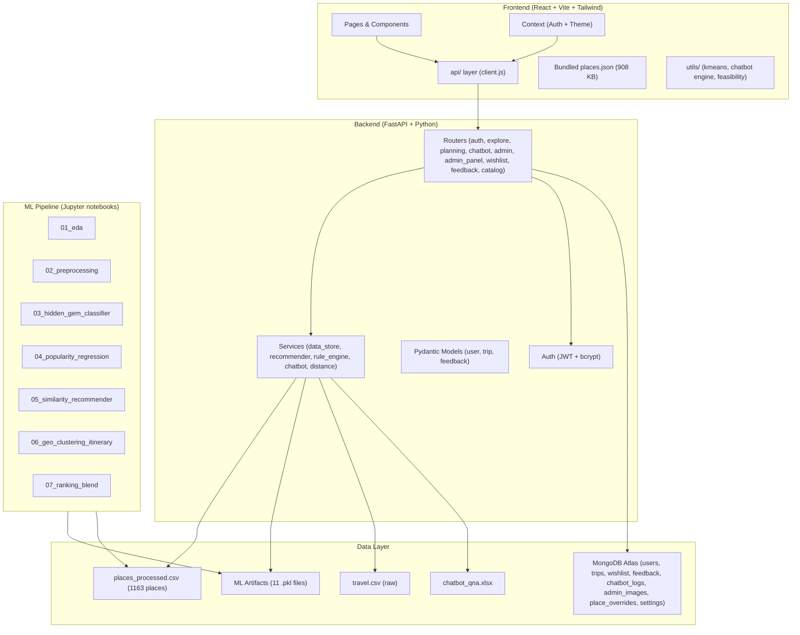
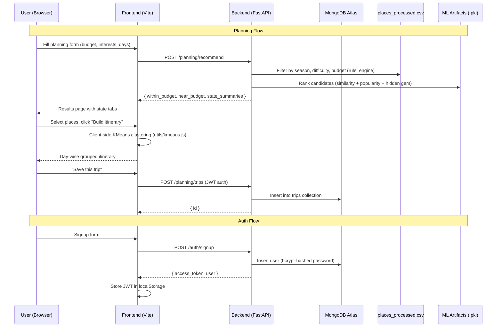

# VOYEXA AI — Full Project Audit

> **Date**: 2026-09-28 | **Status**: Read-only analysis, no files modified

---

## 1. Architecture Overview



---

## 2. Technology Stack

| Layer | Technology | Version |
|-------|-----------|---------|
| Frontend framework | React | 18.3.1 |
| Routing | react-router-dom | 7.18.4 |
| Build tool | Vite | 8.3.0 |
| CSS framework | Tailwind CSS | 3.4.7 |
| PDF generation | jsPDF | 4.2.1 |
| Backend framework | FastAPI | ≥0.111.0 |
| Database | MongoDB Atlas (via motor) | ≥3.4.0 |
| Auth | JWT (python-jose) + bcrypt (passlib) | — |
| ML models | scikit-learn | ≥1.5.0 |
| Data processing | pandas + joblib | — |

---

## 3. File Inventory

### Backend (`backend/app/`)
| File | Purpose | LOC |
|------|---------|-----|
| [main.py](file:///d:/Project_Self/VOYEXAAI/backend/app/main.py) | FastAPI app, lifespan, router registration | 84 |
| [config.py](file:///d:/Project_Self/VOYEXAAI/backend/app/config.py) | Pydantic settings from `.env` | 44 |
| [db/mongo.py](file:///d:/Project_Self/VOYEXAAI/backend/app/db/mongo.py) | Motor client, collections, indexes | 77 |
| [auth/security.py](file:///d:/Project_Self/VOYEXAAI/backend/app/auth/security.py) | Password hashing + JWT encode/decode | 37 |
| [auth/dependencies.py](file:///d:/Project_Self/VOYEXAAI/backend/app/auth/dependencies.py) | `get_current_user` + `require_admin` deps | 46 |
| [models/user.py](file:///d:/Project_Self/VOYEXAAI/backend/app/models/user.py) | User Pydantic schemas | 48 |
| [models/trip.py](file:///d:/Project_Self/VOYEXAAI/backend/app/models/trip.py) | Trip Pydantic schemas | 43 |
| [models/feedback.py](file:///d:/Project_Self/VOYEXAAI/backend/app/models/feedback.py) | Feedback Pydantic schemas | 22 |
| [routers/auth.py](file:///d:/Project_Self/VOYEXAAI/backend/app/routers/auth.py) | /auth routes (signup, login, me, update) | 96 |
| [routers/explore.py](file:///d:/Project_Self/VOYEXAAI/backend/app/routers/explore.py) | /explore routes (list, filter, detail) | 77 |
| [routers/planning.py](file:///d:/Project_Self/VOYEXAAI/backend/app/routers/planning.py) | /planning routes (recommend, itinerary, trips CRUD) | 128 |
| [routers/chatbot.py](file:///d:/Project_Self/VOYEXAAI/backend/app/routers/chatbot.py) | /chatbot route + unanswered log | 52 |
| [routers/admin.py](file:///d:/Project_Self/VOYEXAAI/backend/app/routers/admin.py) | /admin/images management | 98 |
| [routers/admin_panel.py](file:///d:/Project_Self/VOYEXAAI/backend/app/routers/admin_panel.py) | Full admin panel API (users, feedback, places, analytics, export, settings) | 601 |
| [routers/wishlist.py](file:///d:/Project_Self/VOYEXAAI/backend/app/routers/wishlist.py) | /me/wishlist toggle | 29 |
| [routers/feedback.py](file:///d:/Project_Self/VOYEXAAI/backend/app/routers/feedback.py) | /feedback CRUD | 53 |
| [routers/catalog.py](file:///d:/Project_Self/VOYEXAAI/backend/app/routers/catalog.py) | /catalog/overlay (public) | 22 |
| [services/data_store.py](file:///d:/Project_Self/VOYEXAAI/backend/app/services/data_store.py) | In-memory CSV loader + place_to_dict | 60 |
| [services/recommender.py](file:///d:/Project_Self/VOYEXAAI/backend/app/services/recommender.py) | ML ranking: similarity + popularity + hidden gem | 106 |
| [services/chatbot.py](file:///d:/Project_Self/VOYEXAAI/backend/app/services/chatbot.py) | 3-layer chatbot (FAQ → dataset → fallback) | 166 |
| [services/rule_engine.py](file:///d:/Project_Self/VOYEXAAI/backend/app/services/rule_engine.py) | Season/difficulty/budget filters | 53 |
| [services/distance.py](file:///d:/Project_Self/VOYEXAAI/backend/app/services/distance.py) | Haversine + spread warning | 34 |
| **⛔ MISSING: services/itinerary.py** | Imported by planning.py but file doesn't exist | — |
| **⛔ MISSING: services/place_overlay.py** | Imported by planning.py, admin_panel.py, catalog.py but file doesn't exist | — |

### Frontend (`frontend/src/`)
| File | Purpose | Size |
|------|---------|------|
| [App.jsx](file:///d:/Project_Self/VOYEXAAI/frontend/src/App.jsx) | Root routes (user site + admin lazy-load) | 4.3 KB |
| [main.jsx](file:///d:/Project_Self/VOYEXAAI/frontend/src/main.jsx) | Entry point with overlay pre-load | 1.0 KB |
| 12 pages, 10 components, 9 API modules, 8 utility modules, 2 contexts | — | — |

---

## 4. Data Flow Diagram



---

## 5. Authentication & Authorization Architecture

| Aspect | Implementation |
|--------|---------------|
| Password storage | bcrypt via passlib |
| Token format | JWT HS256, 24h expiry |
| Token storage | `localStorage` (`voyexa_token`) |
| User role model | `"user"` (default) / `"admin"` (via `admin_key`) |
| Protected routes (frontend) | `<ProtectedRoute>` checks `isAuthenticated` |
| Protected routes (backend) | `get_current_user` (any user) / `require_admin` (admin only) |
| Admin gate | `ADMIN_SIGNUP_KEY` env var must match body's `admin_key` |

---

## 6. MongoDB Collections & Indexes

| Collection | Index | Usage |
|------------|-------|-------|
| `users` | `email` (unique) | Auth, profile |
| `trips` | `user_id` | Trip history |
| `wishlist` | `(user_id, place_id)` (unique compound) | Per-user wishlist |
| `admin_images` | `place_id` (unique) | Google Drive image URLs |
| `place_overrides` | `place_id` (unique) | Admin edits/removes/adds |
| `settings` | `key` (unique) | Power BI embed URL |
| `feedback` | (none) | User feedback |
| `chatbot_logs` | (none) | Unanswered questions |

---

## 7. ML Models & Artifacts

| Artifact | Source Notebook | Size | Purpose |
|----------|----------------|------|---------|
| `hidden_gem_classifier.pkl` | 03 | 2.6 MB | Classifies places as hidden gems |
| `hidden_gem_features.pkl` | 03 | 3.8 KB | Feature column list for classifier |
| `popularity_regressor.pkl` | 04 | 9.1 MB | Predicts popularity rating |
| `popularity_features.pkl` | 04 | 3.7 KB | Feature column list for regressor |
| `similarity_feature_matrix.pkl` | 05 | 1.6 MB | Pre-computed feature vectors for cosine similarity |
| `similarity_vec_cols.pkl` | 05 | 3.4 KB | Column names for the feature matrix |
| `interest_mlb.pkl` | — | 2.3 KB | MultiLabelBinarizer for interest tags |
| `suitable_mlb.pkl` | — | 696 B | MultiLabelBinarizer for suitability |
| `scaler.pkl` | — | 1.1 KB | Feature scaler |
| `difficulty_map.json` | — | 54 B | Difficulty level encoding |
| `state_budget_lookup.csv` | — | 1.2 KB | State-level budget reference |

---

## 8. Critical Errors (Will Crash at Runtime)

> [!CAUTION]
> These are **fatal** — the backend will not start or will crash on first use.

### 🔴 E1: Missing `services/itinerary.py`

[planning.py:12](file:///d:/Project_Self/VOYEXAAI/backend/app/routers/planning.py#L12) imports:
```python
from app.services.itinerary import cluster_into_days
```
**The file `backend/app/services/itinerary.py` does not exist.** Only a `__pycache__/itinerary.cpython-314.pyc` exists, meaning the file was deleted after being compiled once. The `POST /planning/itinerary` endpoint will crash with `ModuleNotFoundError`.

### 🔴 E2: Missing `services/place_overlay.py`

Three routers import it:
- [planning.py:16](file:///d:/Project_Self/VOYEXAAI/backend/app/routers/planning.py#L16): `from app.services import place_overlay as po`
- [admin_panel.py:50](file:///d:/Project_Self/VOYEXAAI/backend/app/routers/admin_panel.py#L50): `from app.services import place_overlay as po`
- [catalog.py:9](file:///d:/Project_Self/VOYEXAAI/backend/app/routers/catalog.py#L9): `from app.services.place_overlay import load_overlay`

**The file `backend/app/services/place_overlay.py` does not exist.** Neither does a `.pyc` for it. This will crash the entire backend at import time — **the server cannot start at all**.

Functions referenced but undefined: `po.load_overlay()`, `po.effective_df()`, `po.effective_places()`, `po.base_places()`, `po.apply_overlay()`, `po.Overlay`, `po.coerce_fields()`, `po.CUSTOM_DEFAULTS`, `po.next_custom_id()`.

### 🔴 E3: Missing `logUnansweredQuestion` export

[chatbotEngine.js:17](file:///d:/Project_Self/VOYEXAAI/frontend/src/utils/chatbotEngine.js#L17) imports:
```javascript
import { logUnansweredQuestion } from "../api/unanswered.js";
```
But [unanswered.js](file:///d:/Project_Self/VOYEXAAI/frontend/src/api/unanswered.js) **does not export any function named `logUnansweredQuestion`**. Its exports are: `refreshUnansweredQuestions`, `getUnansweredQuestions`, `clearUnansweredQuestions`, `useUnansweredQuestions`. This will crash the old client-side chatbot engine if it's ever imported. (Currently the `ChatWidget` uses the backend chatbot API instead, so this only matters if anyone imports `chatbotEngine.js`.)

---

## 9. Security Issues

> [!WARNING]
> These need attention before any deployment.

| # | Severity | Issue | Location |
|---|----------|-------|----------|
| S1 | 🔴 **Critical** | **MongoDB credentials committed to `.env`** — Atlas URI with plain-text username/password (`voyexa_user:voyexa_AI2026`) is in the tracked `.env` file | [backend/.env](file:///d:/Project_Self/VOYEXAAI/backend/.env) |
| S2 | 🟠 High | **JWT secret left at default** (`change-this-before-deploying`). Anyone who knows the default can forge tokens. The startup warning is not enough. | [config.py:19](file:///d:/Project_Self/VOYEXAAI/backend/app/config.py#L19) |
| S3 | 🟠 High | **Admin signup key left at default** (`change-this-too`). The signup guard in `admin_panel.py` blocks this, but regular `/auth/signup` still accepts it as a valid `admin_key` match — someone could send `admin_key=change-this-too` and become admin. | [config.py:27](file:///d:/Project_Self/VOYEXAAI/backend/app/config.py#L27) + [auth.py:39](file:///d:/Project_Self/VOYEXAAI/backend/app/routers/auth.py#L39) |
| S4 | 🟡 Medium | **No rate limiting** on login, signup, chatbot, or any endpoint. Brute-force and spam attacks are trivially possible. | All routes |
| S5 | 🟡 Medium | **`/chatbot/unanswered` GET is unauthenticated** — anyone can read all unanswered chatbot questions (may contain user PII or sensitive queries). | [chatbot.py:36-44](file:///d:/Project_Self/VOYEXAAI/backend/app/routers/chatbot.py#L36-L44) |
| S6 | 🟡 Medium | **`/chatbot/unanswered` DELETE requires any user, not admin** — a regular user can wipe all chatbot logs. | [chatbot.py:47-51](file:///d:/Project_Self/VOYEXAAI/backend/app/routers/chatbot.py#L47-L51) |
| S7 | 🟡 Medium | **No password change or reset** mechanism exists. Users who forget their password have no recovery path. | — |
| S8 | 🟡 Medium | **JWT is never refreshed** — a 24-hour token means a user who stays logged in longer must re-login, but there's no auto-refresh mechanism. | [security.py](file:///d:/Project_Self/VOYEXAAI/backend/app/auth/security.py) |

---

## 10. Architectural Inconsistencies

> [!IMPORTANT]
> These are design mismatches between frontend and backend that will cause functional bugs.

| # | Issue | Detail |
|---|-------|--------|
| A1 | **Itinerary built client-side, not via backend** | [Itinerary.jsx](file:///d:/Project_Self/VOYEXAAI/frontend/src/pages/Itinerary.jsx#L4) uses `clusterIntoDays` from local `utils/kmeans.js` + `checkTripFeasibility`, **never calling** `POST /planning/itinerary`. The backend itinerary endpoint exists but is unused by the frontend. The backend would use admin overlay data; the client-side clustering doesn't. |
| A2 | **Explore page uses bundled JSON, not backend API** | [Explore.jsx](file:///d:/Project_Self/VOYEXAAI/frontend/src/pages/Explore.jsx#L4) imports `places.json` directly and filters client-side. The backend's `GET /explore` with its admin-image attachment is never called. So admin image overrides never show on the Explore page. |
| A3 | **Dual chatbot engines** | The old [chatbotEngine.js](file:///d:/Project_Self/VOYEXAAI/frontend/src/utils/chatbotEngine.js) (client-side, 221 lines) is dead code — [ChatWidget.jsx](file:///d:/Project_Self/VOYEXAAI/frontend/src/components/chatbot/ChatWidget.jsx#L2) now calls `askChatbot` (backend). The old file still imports a non-existent `logUnansweredQuestion`. |
| A4 | **Recommend endpoint skips auth, trip save requires it** | `POST /planning/recommend` is `auth: false` on the frontend, so anonymous users can get recommendations. But saving the trip (`POST /planning/trips`) requires login. This is arguably intentional but undocumented. |
| A5 | **Admin `place_overrides` affects recommendations but not Explore/Itinerary client-side** | The overlay system only works in backend routes that call `po.load_overlay()`. The frontend's bundled `places.json` gets overlaid once at startup (via `placeOverlay.js`), but the planning form's interest list, the Explore page's filter dropdowns, and the Itinerary page's `places.filter()` all read from the bundled JSON. If the backend is slow/down during page load, overlays are silently skipped. |
| A6 | **`Results.jsx` gets state from `location.state`, not from a store** | If a user refreshes the Results page, `location.state` is `null` and they're bounced to `/plan`. This is a UX trap — results are not persisted. |
| A7 | **Trip (current cart) is in localStorage only** | The "current trip" (`api/trip.js`) never syncs to MongoDB — it's purely client-side localStorage. If the user clears browser data mid-planning, their trip selection is lost. |

---

## 11. Frontend Code Issues

| # | Severity | Issue | File |
|---|----------|-------|------|
| F1 | 🟡 | **React Hooks called conditionally** — `useState` for `saveError` and `saving` are called inside `Itinerary.jsx` *after* early returns. This violates Rules of Hooks and will crash in development. | [Itinerary.jsx:42-43](file:///d:/Project_Self/VOYEXAAI/frontend/src/pages/Itinerary.jsx#L42-L43) |
| F2 | 🟡 | **908 KB bundled `places.json`** — shipped to every visitor even though the backend already has `GET /explore`. This bloats the initial bundle significantly. | [places.json](file:///d:/Project_Self/VOYEXAAI/frontend/src/data/places.json) |
| F3 | 🟡 | **Hardcoded "6 Zones covered"** on the Home page instead of deriving it from data. If zones change, this goes stale. | [Home.jsx:92](file:///d:/Project_Self/VOYEXAAI/frontend/src/pages/Home.jsx#L92) |
| F4 | 🟢 | **PlaceImage.jsx** not audited in detail but likely has a fallback for missing images. The `getImage(placeId)` from `adminImages.js` is separate from the explore endpoint's `image_url`. Two different image systems overlap. | — |
| F5 | 🟢 | **No error boundary** in the React tree. Any unhandled error crashes the entire app with a blank screen. | [App.jsx](file:///d:/Project_Self/VOYEXAAI/frontend/src/App.jsx) |
| F6 | 🟢 | **`useEffect` dependency warning** — [Results.jsx:37](file:///d:/Project_Self/VOYEXAAI/frontend/src/pages/Results.jsx#L37) has `[form]` as dependency where `form` is an object from `location.state`, causing the effect to re-run on every render (object identity changes). | [Results.jsx](file:///d:/Project_Self/VOYEXAAI/frontend/src/pages/Results.jsx) |
| F7 | 🟢 | **No loading states or skeleton screens** — pages show nothing while waiting for API responses. The Explore page doesn't even call the API (see A2). | Multiple pages |

---

## 12. Backend Code Issues

| # | Severity | Issue | File |
|---|----------|-------|------|
| B1 | 🟡 | **Global mutable DataFrame** — `data_store._df` is a global mutable shared across all requests. If any request modifies the DataFrame in place (e.g., `filter_candidates` returning a filtered view), it could corrupt the state for subsequent requests. Some routes do `df = get_places_df()` then filter `df[mask]`, which creates views, not copies. | [data_store.py](file:///d:/Project_Self/VOYEXAAI/backend/app/services/data_store.py) |
| B2 | 🟡 | **Explore endpoint fetches ALL admin images on every request** — `admin_images_collection().find({})` runs a full collection scan on every `GET /explore` call. Not indexed for this pattern. | [explore.py:47](file:///d:/Project_Self/VOYEXAAI/backend/app/routers/explore.py#L47) |
| B3 | 🟡 | **`_to_user_out` imported across modules** — `admin_panel.py` imports `_to_user_out` (a private function) from `auth.py`, creating tight coupling. | [admin_panel.py:49](file:///d:/Project_Self/VOYEXAAI/backend/app/routers/admin_panel.py#L49) |
| B4 | 🟡 | **Missing `feedback` index for `chatbot_logs`** — `chatbot_logs` sorts by `created_at` but has no index, causing full scans as logs grow. Similarly `feedback` sorts by `created_at` with no index. | [mongo.py](file:///d:/Project_Self/VOYEXAAI/backend/app/db/mongo.py) |
| B5 | 🟢 | **`ensure_indexes()` called every startup** — safe but slightly wasteful. Using `createIndex` with `background=True` or checking existence first would be cleaner. | [mongo.py:69-76](file:///d:/Project_Self/VOYEXAAI/backend/app/db/mongo.py#L69-L76) |
| B6 | 🟢 | **Chatbot iterates all places on every question** — `match_dataset()` does a linear scan of the entire DataFrame. For 1,163 places this is fine, but the pattern doesn't scale. | [chatbot.py:111](file:///d:/Project_Self/VOYEXAAI/backend/app/services/chatbot.py#L111) |
| B7 | 🟢 | **Recommender `rank()` function takes `within` DataFrame's `place_id.tolist()` but returns a different DataFrame** — the returned DataFrame has `_similarity` and `_final_score` columns that then get passed to `place_to_dict()`, which silently ignores them. Works, but the shape mismatch is confusing. | [planning.py:29-30](file:///d:/Project_Self/VOYEXAAI/backend/app/routers/planning.py#L29-L30) |
| B8 | 🟢 | **No HTTPS enforcement** — CORS allows `http://localhost:5173` but there's no redirect to HTTPS or HSTS header for production. | [config.py:32](file:///d:/Project_Self/VOYEXAAI/backend/app/config.py#L32) |

---

## 13. Dead Code & Unused Files

| File | Status | Notes |
|------|--------|-------|
| [chatbotEngine.js](file:///d:/Project_Self/VOYEXAAI/frontend/src/utils/chatbotEngine.js) | 🟡 Dead | 221 lines of client-side chatbot replaced by backend. Imports broken `logUnansweredQuestion`. |
| [chatbotQnA.json](file:///d:/Project_Self/VOYEXAAI/frontend/src/data/chatbotQnA.json) | 🟡 Dead | Only used by dead `chatbotEngine.js`. Backend reads from `.xlsx` directly. |
| [kmeans.js](file:///d:/Project_Self/VOYEXAAI/frontend/src/utils/kmeans.js) | 🟡 Partial | Used by `Itinerary.jsx` client-side, but backend has its own (missing) `itinerary.py`. Duplicated logic. |
| [tripFeasibility.js](file:///d:/Project_Self/VOYEXAAI/frontend/src/utils/tripFeasibility.js) | 🟢 Active | Used by Itinerary page. No backend equivalent — feasibility is client-only. |
| [ml/models/](file:///d:/Project_Self/VOYEXAAI/ml/models) | 🟡 Empty | The models directory is empty. Trained model code might have been here. |
| [ml/preprocessing/seed_chatbot_excel.py](file:///d:/Project_Self/VOYEXAAI/ml/preprocessing/seed_chatbot_excel.py) | 🟢 Utility | Generates the chatbot QnA Excel. |
| [ml/preprocessing/build_chatbot_data.py](file:///d:/Project_Self/VOYEXAAI/ml/preprocessing/build_chatbot_data.py) | 🟡 Partial | Builds `chatbotQnA.json` for the frontend, but the frontend no longer uses it (dead `chatbotEngine.js`). |

---

## 14. Deployment Readiness

| Criterion | Status | Notes |
|-----------|--------|-------|
| Backend can start | ❌ **No** | Missing `place_overlay.py` causes `ModuleNotFoundError` at import time |
| Frontend can build | ⚠️ **Likely yes** | Dead code import of `logUnansweredQuestion` only breaks if `chatbotEngine.js` is tree-shaken in |
| Environment secrets | ❌ **Committed** | MongoDB credentials in tracked `.env`; JWT/admin secrets at defaults |
| CORS for production | ❌ **Not configured** | Only `localhost:5173` allowed |
| Database indexes | ⚠️ **Partial** | No indexes on `feedback.created_at` or `chatbot_logs.created_at` |
| Error handling | ⚠️ **Basic** | No React error boundary; backend returns raw 500s on unexpected errors |
| Monitoring/logging | ❌ **None** | Only `print()` statements; no structured logging, no APM |
| Tests | ❌ **None** | Zero test files in the entire project |
| CI/CD | ❌ **None** | No GitHub Actions, no Dockerfile |

---

## 15. Priority Fix List

| Priority | Issue | Impact | Estimated Effort |
|----------|-------|--------|-----------------|
| **P0** | Create `services/place_overlay.py` | Backend cannot start at all | ~120 lines |
| **P0** | Create `services/itinerary.py` | `/planning/itinerary` crashes | ~40 lines |
| **P0** | Rotate MongoDB credentials (`.env` exposed) | Security breach risk | Config change |
| **P1** | Set real `JWT_SECRET` and `ADMIN_SIGNUP_KEY` | Token forgery possible | Config change |
| **P1** | Fix Hooks ordering in `Itinerary.jsx` | React crash in dev | Move useState calls |
| **P1** | Protect `/chatbot/unanswered` with `require_admin` | Data leak | 1-line change |
| **P2** | Remove dead `chatbotEngine.js` and `chatbotQnA.json` | Clarity, bundle size | Delete files |
| **P2** | Wire Explore page to backend API instead of bundled JSON | Admin overlays visible | Moderate refactor |
| **P2** | Add missing DB indexes (feedback, chatbot_logs) | Performance at scale | 2 lines in `ensure_indexes` |
| **P3** | Add React error boundary | Prevent blank-screen crashes | Small component |
| **P3** | Add rate limiting | Prevent brute-force attacks | Middleware |
| **P3** | Persist Results page state (URL params or store) | Fix refresh loss | Moderate |

---

## 16. Summary

VOYEXA AI is a well-structured full-stack travel recommendation platform with a solid ML pipeline, clean auth architecture, and thoughtful admin panel. However, **two missing backend service files** (`place_overlay.py` and `itinerary.py`) make the backend completely non-functional. Additionally, the frontend has a **split-brain problem** — it bundles a 908 KB `places.json` and does much of its work client-side (Explore filtering, itinerary clustering, trip feasibility) while the backend provides equivalent APIs that go unused. The project has **no tests, no CI/CD, committed credentials, and default security secrets**.

The highest-priority items are:
1. **Recreate the two missing service files** so the backend can start
2. **Rotate the committed MongoDB credentials**
3. **Set production-grade JWT and admin secrets**
4. **Fix the React Hooks violation in Itinerary.jsx**

After these, the focus should shift to reconciling the frontend–backend data layer (eliminating the bundled JSON or at least keeping it as a cache with backend as source of truth) and adding basic security hardening (rate limiting, protected unanswered endpoint, error boundaries).
